# Pleasure Pants Paul

A text-parser graphic adventure in the style of Sierra's 1987 AGI games.
Sixteen EGA colours, a 160x200 double-wide-pixel picture, arrow-key walking,
a `>` prompt, and a hero in a white polyester leisure suit who deserves none
of what happens to him.

Working title. All art, text, rooms and puzzles are original.

## Run it

```sh
uv sync
uv run ppp              # title -> age quiz -> game
uv run ppp --skip-quiz  # straight into room 10
uv run ppp --scale 4    # bigger window (integer scale, default 3)
```

Walk with the arrow keys (press the same arrow again to stop, like the
original). Type commands such as `look`, `look bar`, `talk to bartender`,
`buy whiskey`, `give whiskey to drunk`, `call a cab`, `search dumpster`,
`inventory`, `score`, `quit`.

Rooms so far: the street outside Rooster's (10), the bar (11), the alley to
the west (12), the inside of a cab (13), the men's room (14), the back room
behind the alley door (15), the room upstairs (16), the Kwik-Snak with its
own street (17, 18), the Boogie Palace (19, 20), the Golden Sock Casino
(21, 22) and the Chapel of Eternal Regret (23, 24), each with its own
street, and the casino penthouse (25). See the player's guide below.

Alt-X (or Cmd-X on a Mac) skips the age quiz.

**ESC** opens the Sierra menu bar (File, Action, Special, Speed). Left and
right arrows switch menus, up and down pick an item, ENTER activates, ESC
closes. Shortcuts: F1 help, F2 sound on/off, F3 score, F4 look, F5 save,
F7 restore, F9 restart, Tab inventory, Alt-Z (Cmd-Z) quit. Typing `save`,
`restore`, `restart` or `quit` at the prompt does the same thing.

Saved games are JSON files, twelve most recent kept, in:

| Platform | Directory |
|---|---|
| macOS | `~/Library/Application Support/PleasurePantsPaul/saves` |
| Windows | `%APPDATA%\PleasurePantsPaul\saves` |
| Linux | `$XDG_DATA_HOME/PleasurePantsPaul/saves` |

Set `PPP_SAVE_DIR` to override.

## Player's guide

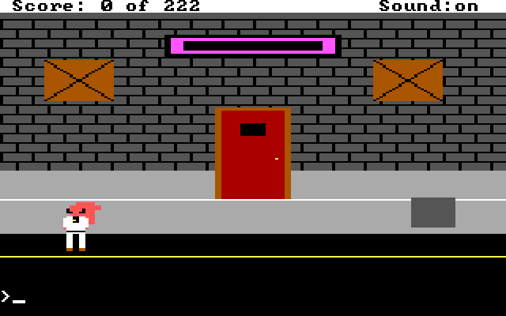

You are Paul. It is late, you are single, and you are wearing the suit. The
goal, eventually, is love, or a reasonable facsimile. For now the goal is to
survive the block around Rooster's with your wallet and your pulse.

### Controls

| Key | What it does |
|---|---|
| Arrow keys | Walk. Press the same arrow again to stop. Diagonals on the numpad, Home/End/PgUp/PgDn. |
| Typing + ENTER | Talk to the parser: `look`, `look at bartender`, `buy whiskey`, `give whiskey to drunk`. |
| Any key | Dismiss a message box. |
| ESC | Open the menu bar. Arrows move, ENTER picks, ESC closes. |
| F1 / F2 / F3 / F4 | Help, sound on/off, score, look. |
| F5 / F7 / F9 | Save, restore, restart. |
| Tab | Inventory. |
| Alt-Z (Cmd-Z) | Quit. |
| Alt-X (Cmd-X) | Skip the age quiz. You didn't hear it from me. |

Walking into a doorway enters it; walking off the edge of the screen goes to
the next one. The parser understands verb-noun sentences and ignores filler
words, so `pick up the wilted rose` and `get rose` are the same thing. When
you get a response like *"I don't know the word ..."* the word isn't in the
vocabulary; try a synonym. When Paul refuses, you're probably not standing
close enough.

### The age quiz

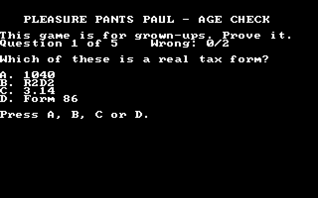

Five questions about mortgages, tax forms and happy hour. Get more than two
wrong and you're sent home. Grown-ups will be fine.

### The street

Rooster's is the red door under the pink neon. The alley is off to the west.
The road is for cars; standing in the far lane for long is a short story with
an unhappy ending. `Call a cab` and one pulls up at the curb.

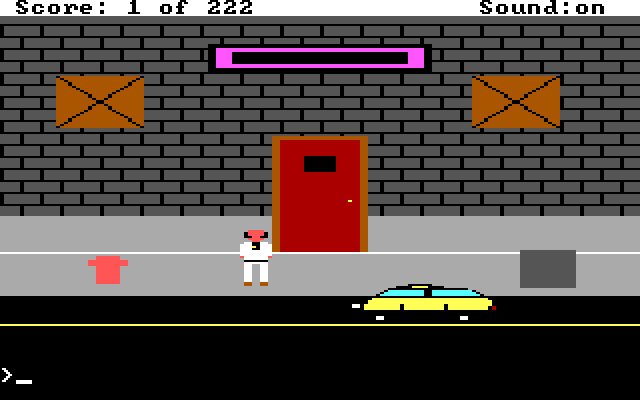

### Rooster's

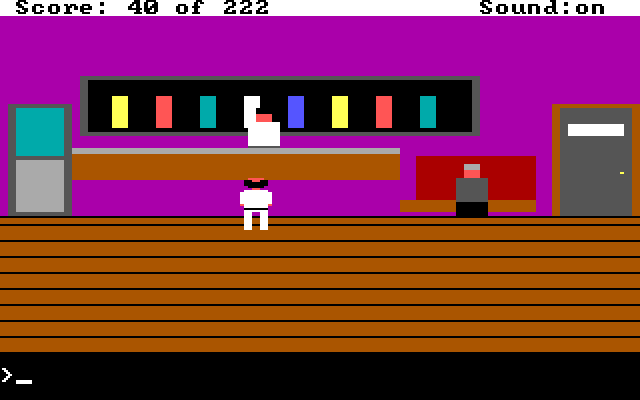

Walk up to the bar to `talk to the bartender` and `buy whiskey` (ten dollars;
you start with ninety-four). The gentleman in the booth would like a drink.
The door on the right marked MEN is worth a visit.

### The men's room

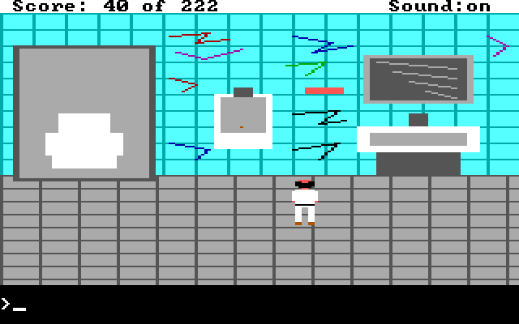

`Read the graffiti`, repeatedly. Most of it is what you'd expect. One line is
not.

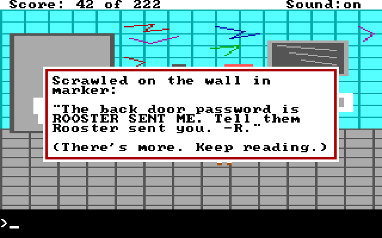

### The alley

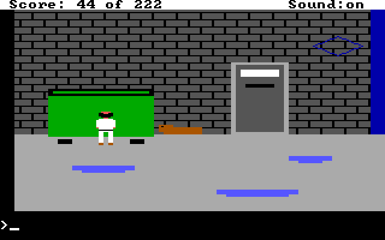

A dumpster worth searching, a dog worth leaving alone, and a steel door with
a slot that wants a password. Don't stand around: someone else uses this
alley, and he's not there to chat.

### The back room

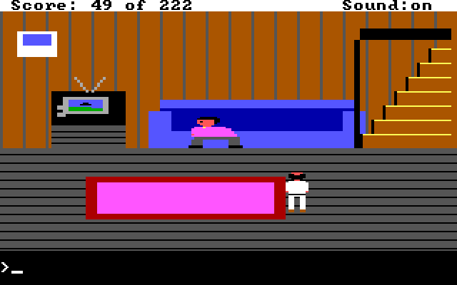

Through the alley door, once it opens. Brick lives on the couch and the
stairs live behind Brick. He is watching television. Think about what would
make a man like that stop paying attention, and about who gave you what.

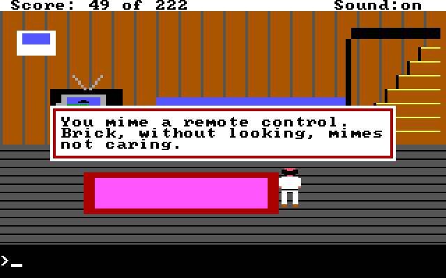

### Upstairs

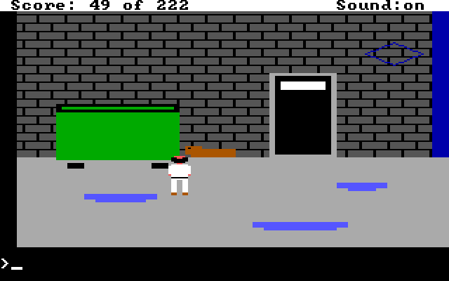

Dolores has a price, a nail file, and a box of chocolates she is not sharing.
She might soften for a small gesture. What she sells costs thirty dollars,
and doing business without protection is the oldest death in the genre.
The Kwik-Snak sells protection; take a cab. The window is the quick way
down.

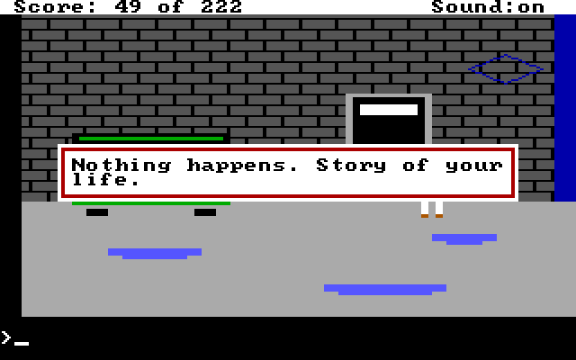

### The cab

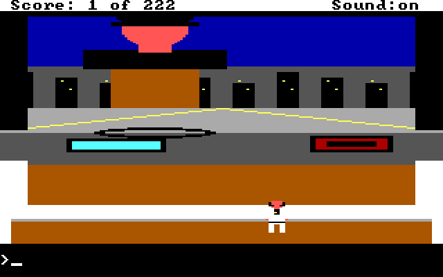

Tell the driver where to go: `store`, `disco`, `casino`, `chapel` or
`Rooster's`. All five are real now, and the meter runs anyway. `Pay the driver`, then `get out`.
Don't try it the other way round.

### The Kwik-Snak

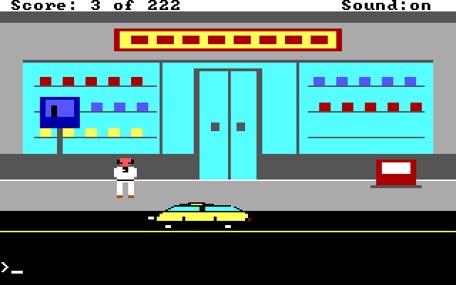

Where the cab drops you. A pay phone, a newspaper box, and glass doors that
open for anyone. Call a cab from here to get back.

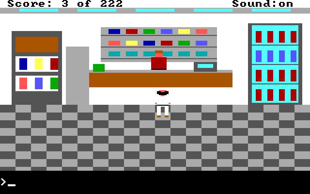

Three things worth buying: wine, a magazine in brown paper, and the thing
you have to ask for out loud. Ask at the counter. Don't pocket anything; the
sign by the register is not a joke.

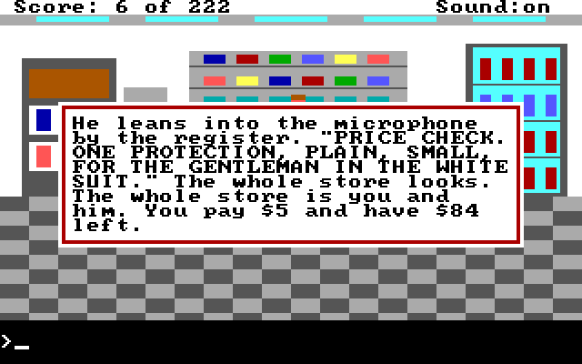

### The Golden Sock

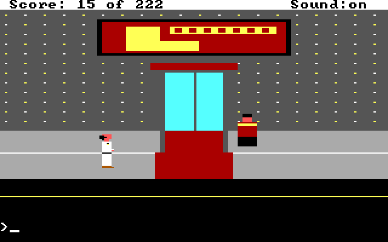

The casino. Slots along the left wall at five dollars a pull; a blackjack
table in the middle that takes bets from five to a hundred (`play
blackjack`, `bet 20`, `hit`, `stand`, `leave`); and a prize counter on the
right with one diamond ring at two hundred and fifty dollars. You arrived
with less than that. The tables are that way. Save first; the original
players did.

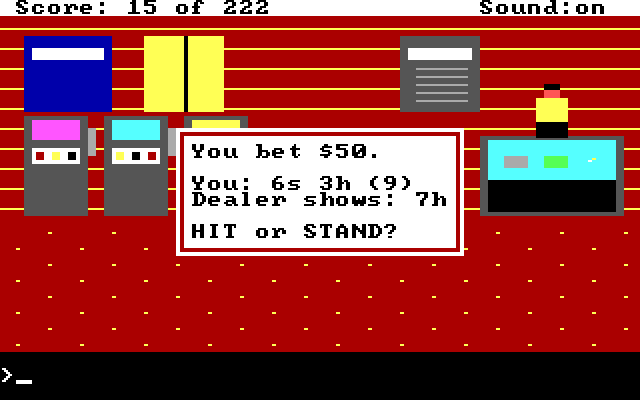

### The Chapel of Eternal Regret

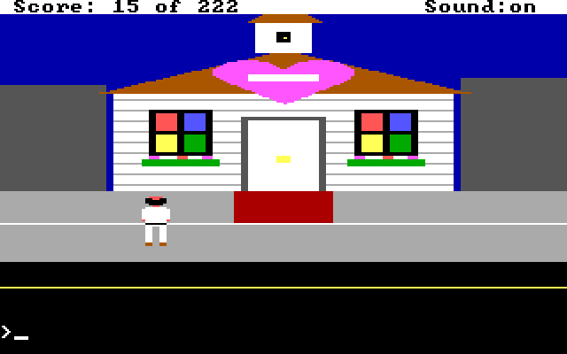

Walk-ins welcome, no refunds. Once Ginger has asked for a ring she'll be
waiting at the altar in a veil. The preacher wants fifty dollars and a
ring, in that order, and then the word. The bell is for after. The
collection box is for the needy, and they are well defended.

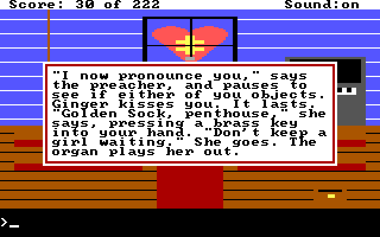

### The penthouse

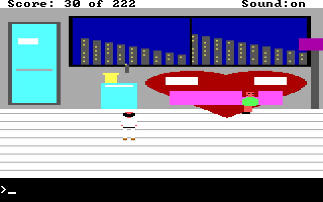

The honeymoon suite, at the top of the casino elevator, with the key from
the chapel. Ginger is waiting with two glasses. What happens next is the
oldest turn in the genre, so save first, and keep your money somewhere
other than your wallet if you can think of anywhere. Afterwards your
options are limited and mostly involve your feet.

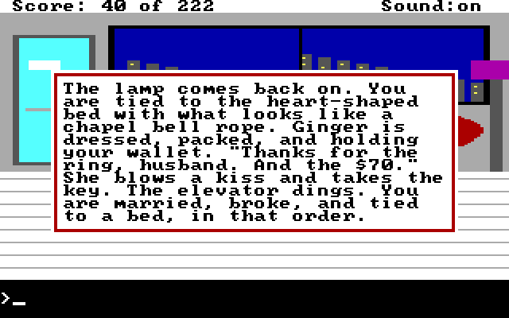

### The Boogie Palace

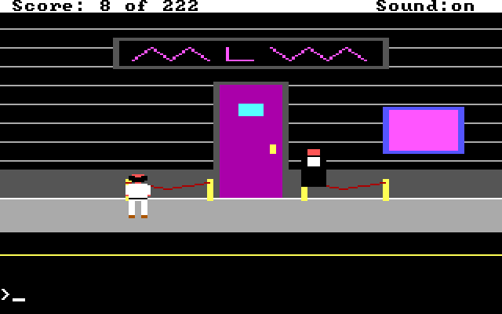

Members only, says the doorman, and you are not a member. He isn't after
money. He has money. Look at what you're carrying and think about what a
bored man on a door might want to read.

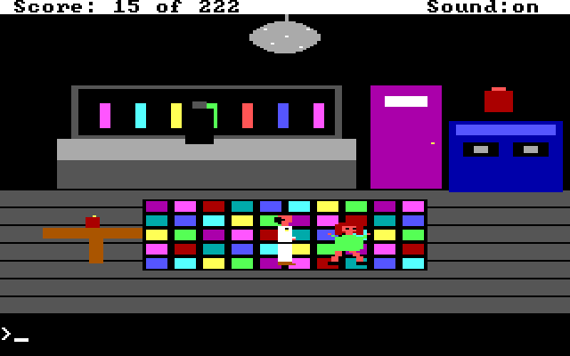

Inside: a lit floor, a mirror ball, a DJ, and Ginger, alone at the only
table. She likes gifts, in the right order, and then she likes to dance.
After that she wants a ring, and she'll tell you where to meet her. Leave
the LADIES door alone.

### Dying

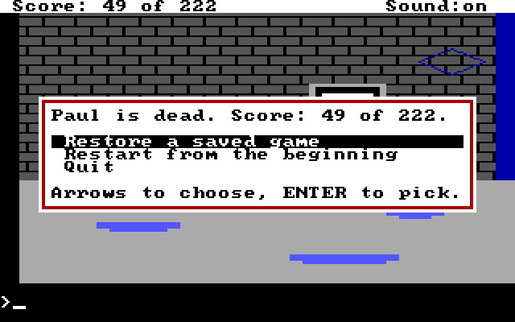

Paul dies easily and often. The box offers restore, restart or quit. Save
before you do anything clever, and especially before you do anything stupid.

<details>
<summary>Walkthrough of everything scoreable so far (spoilers)</summary>

| Points | How |
|---|---|
| 2 | In Rooster's, at the bar: `buy whiskey`. |
| 4 | Walk to the booth: `give whiskey to drunk`. He hands over a TV remote. |
| 2 | In the men's room: `read graffiti` until you reach the password line. |
| 2 | In the alley: `search dumpster`, then `get rose`. |
| 5 | In the alley, by the steel door: `rooster sent me`. Then walk in. |
| 4 | In the back room, with the drunk's remote: `use remote`. |
| 5 | While Brick is glued to the fight, walk up the stairs. |
| 2 | Upstairs, with the rose from the dumpster: `give rose to dolores`. |
| 3 | Then, at the nightstand: `get chocolates`. |
| 15 | `Pay dolores`, then `kiss dolores`, with protection from the Kwik-Snak in your pocket. |
| 1 | On the street: `call a cab`. |
| 1 each | In the cab: ride to the store, casino, disco or chapel. |
| 1 | In the cab: `pay the driver`. |
| 3 | In the Kwik-Snak, at the counter: `buy protection`. Loudly, in the end. |
| 1 | `Buy wine`. |
| 1 | `Buy magazine`. |
| 2 | Outside the Boogie Palace: `give magazine to doorman`. |
| 3 | Inside, at Ginger's table: `give chocolates to ginger`. |
| 2 | Then `give wine to ginger`. |
| 5 | Then `dance with ginger`. She'll want a ring next. |
| 1 | At the Golden Sock: win anything on the slots. |
| 2 | Win a hand of blackjack. |
| 5 | At the prize counter, with $250: `buy ring`. |
| 15 | At the chapel, with Ginger waiting: `pay preacher`, then `marry ginger`. |
| 1 | Afterwards, by the rope on the left: `pull rope`. |
| 10 | In the penthouse: `kiss ginger`. This costs everything you're carrying. |
| 5 | Tied to the bed: `kick phone`, then wait for housekeeping. |
| 1 | Once free: `read note`. |

That is 107 points of a possible 222, all reachable. After the penthouse
Paul is free, married, and broke, which is where the second half begins.
</details>

The screenshots are regenerated with `uv run python tools/screenshots.py`.

## How faithful is it?

The engine reproduces the AGI model rather than emulating it:

- **Screen**: 320x200, 25 text rows. Row 0 is the status line, rows 1-21 the
  picture, row 23 the parser prompt.
- **Pictures**: not bitmaps. Each room draws its background with vector-style
  commands (rects, lines, polygons, flood fills) into a 160x168 visual screen
  and a matching **priority screen**, exactly like AGI PIC resources. Priority
  bands (4..15, twelve rows each below y=48) decide whether Paul walks in
  front of or behind scenery. Priority 0 is an unwalkable control line.
- **Ego**: 8-unit-wide sprite in picture coordinates, one unit per cycle at
  20 cycles/second. Arrow keys toggle direction, AGI-style.
- **Parser**: words map to synonym groups; noise words are dropped; rooms match
  with `said("give", "whiskey", "drunk")`, `anyword` and `rol` (rest of line).
- **Message boxes**: white, double red border, black text, word-wrapped at 30
  columns, dismissed by any key. Dialogs (save, restore, confirm) use the
  same box with an inverted highlight bar.
- **Menu bar**: ESC replaces the status line with File / Action / Special /
  Speed, with a white dropdown and inverted selection.
- **Speed**: slow, normal, fast, fastest = 10, 20, 40, 80 cycles a second.
- **Font**: public-domain 8x8 IBM PC bitmap font.
- **Score** shown as `Score: N of 222`, awarded once per action.
- **Animated objects**: rooms can return sprites with a baseline, and they
  are drawn in baseline order with Paul, so the cab passes in front of or
  behind him correctly.

## Layout

```
src/ppp/
  main.py      window, main loop, title/quiz/play states
  game.py      state, scoring, inventory, command dispatch, global verbs
  room.py      Room base class (draw, enter, update, said, looks)
  rooms/       one file per room; register() lists them
  sprite.py    ASCII-art to surface, shared by Paul and room objects
  pic.py       Picture: visual + priority screens and drawing commands
  ego.py       Paul's sprite frames, movement, priority-aware blit
  parser.py    tokeniser and said() matcher
  words.py     vocabulary groups
  ui.py        status line, prompt, message box, text pages
  menu.py      menu bar definition, navigation, drawing, F-key shortcuts
  dialog.py    confirm / text-entry / list-pick modal dialogs
  save.py      JSON save files: snapshot, apply, list, platform save dir
  quiz.py      age-verification quiz
  font.py      8x8 font renderer; fontdata.py holds the glyphs
  const.py     geometry, EGA palette, priority bands
```

## Adding a room

Subclass `Room`, set `number`, `name`, `description`, `horizon`, `edges`,
`spawns` and a `looks` table, implement `draw(pic)`, and add it to
`rooms/__init__.py`. Override `said()` for puzzles, `update()` for
per-cycle triggers, and `objects()` for animated sprites. See `rooms/bar.py`
for a puzzle room and `rooms/street.py` for an animated one. Call
`game.die(text)` for a Sierra death.

## Building executables

Both platforms use PyInstaller from the same source:

```sh
uv run pyinstaller --onefile --windowed --name "Pleasure Pants Paul" src/ppp/main.py
```

Run that on a Mac for a `.app`, and on Windows for an `.exe`. There is no
port to do: the game is the same Python on both.

## Development

```sh
uv run pytest
uv run ruff check src tests
uv run mypy src
```

## License

MIT. The font (`fontdata.py`) is public domain, from dhepper/font8x8.
